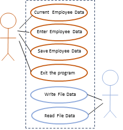
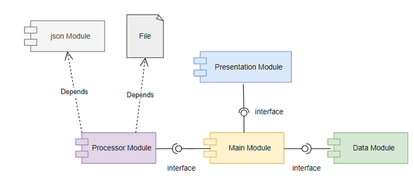
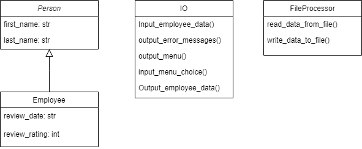

# Application Documentation
This is a documentation of all the code we have designed for our interactive console.

## What does it do?
Our application allows users to enter and track __employees__, their date review and rating. We also can save the user information to a file.

The program has a menu that allows us to enter an employee, view the current data, then save that data to a file for safe keeping. 

Our system handles the ready and saving of the file.
 
The diagram identify __"Use Cases"__ "Current Employee Data", "Enter Employee Data", "Save Employee Data" and "Exit the Program" __used by a human__ user 
and "Write File Data" or "Read File Data" __used by the system__, below the Use-Case Diagram:




The Component Diagram display the physical or logical components of the application and their dependencies.
IN this Diagram the Processors, IO and Data modules provide an interface that the main module can interact with (functions).

The Processor module depends on json module and the file that holds the Json data. Without the Json module and file the application
will not work.

The Processor module also has a dependency on the IO module. This is because the FileProcessor's read and write functions call the 
Output_error_messages() function for error handling.

The IO module also has a dependency on the data module. This is because the IO uses this code to create a student object.




The Class Diagram represents the Person, Employee, FileProcessor and IO classes.
Also, the program includes class properties, methods and inheritance relationship 
between classes.





This application currently supports:

- JSON 
- CSV
  - CSV support is currently removed
- ~~TXT~~

The source code of our repository is [here](https://github.com/alejoguir/Assignment08)


# Class Documentation

---

## Person and Employee

This document provides information about these classes. These classes represent individuals and 
employees with properties for review date and review rating.

### Description

The Person class represent an individual.

### Attributes

- `firstname` (str): first name
- `lastname` (str): last name

```python

## Methods
    def __init__(self, first_name: str = "", last_name: str = ""):
        self.first_name = first_name
        self.last_name = last_name

    @property
    def first_name(self):
        return self.__first_name.title()

    @first_name.setter
    def first_name(self, value: str):
        if value.isalpha() or value == "":
            self.__first_name = value
        else:
            raise ValueError("The first name should not contain numbers.")

    @property
    def last_name(self):
        return self.__last_name.title()

    @last_name.setter
    def last_name(self, value: str):
        if value.isalpha() or value == "":
            self.__last_name = value
        else:
            raise ValueError("The last name should not contain numbers.")

    def __str__(self):
        return f"{self.first_name},{self.last_name}"


### Description

The Employee class represent an employee.

### Attributes

- `review_date` (str): review date
- `review_rating` (int): review rating

## Methods


    def __init__(self, first_name: str = "", last_name: str = "", review_date: str = "1900-01-01", review_rating: int = 3):

        super().__init__(first_name=first_name,last_name=last_name)
        self.review_date = review_date
        self.review_rating = review_rating

    @property
    def review_date(self):
        return self.__review_date

    @review_date.setter
    def review_date(self, value: str):
        try:
            date.fromisoformat(value)
            self.__review_date = value
        except ValueError:
            raise ValueError("Incorrect data format, should be YYYY-MM-DD")

    @property
    def review_rating(self):
        return self.__review_rating

    @review_rating.setter
    def review_rating(self, value: str):
        if value in (1, 2, 3, 4, 5):
            self.__review_rating = value
        else:
            raise ValueError("Please choose only values 1 through 5")

    def __str__(self):
        return f"{self.first_name},{self.last_name},{self.review_date},{self.review_rating}"

# Class IO:

Class IO:
    """
    A collection of presentation layer functions that manage user input and output

    ChangeLog: (Who, When, What)
    AGuillen,12.04.2023,Created Class
    """
    pass

    @staticmethod
    def output_error_messages(message: str, error: Exception = None):
        """ This function displays a custom error messages to the user

        ChangeLog: (Who, When, What)
        AGuillen,12.04.2023,Created function

        :param message: string with message data to display
        :param error: Exception object with technical message to display

        :return: None
        """

        print(message, end="\n\n")
        if error is not None:
            print("-- Technical Error Message -- ")
            print(error, error.__doc__, type(error), sep='\n')


    @staticmethod
    def output_menu(menu: str):
        """ This function displays the menu of choices to the user

        ChangeLog: (Who, When, What)
        AGuillen,12.04.2023,Created function

        :return: None
        """
        print()
        print(menu)
        print()


    @staticmethod
    def input_menu_choice():
        """ This function gets a menu choice from the user

        ChangeLog: (Who, When, What)
        AGuillen,12.04.2023,Created function

        :return: string with the users choice
        """
        choice = "0"
        try:
            choice = input("Enter your menu choice number: ")
            if choice not in ("1", "2", "3", "4"):  # Note these are strings
                raise Exception("Please, choose only 1, 2, 3, or 4")
        except Exception as e:
            IO.output_error_messages(e.__str__())  # passing the exception object to avoid the technical message

        return choice


    @staticmethod
    def output_employee_data(employee_data: list[object]):
        """ This function displays employee data to the user

        ChangeLog: (Who, When, What)
        AGuillen,12.04.2023,Created function

        :param employee_data: list of employee object data to be displayed

        :return: None
        """
        message:str = ''
        print()
        print("-" * 50)
        for employee in employee_data:
            if employee.review_rating == 5:
                message = " {} {} is rated as 5 (Leading)"
            elif employee.review_rating == 4:
                message = " {} {} is rated as 4 (Strong)"
            elif employee.review_rating == 3:
                message = " {} {} is rated as 3 (Solid)"
            elif employee.review_rating == 2:
                message = " {} {} is rated as 2 (Building)"
            elif employee.review_rating == 1:
                message = " {} {} is rated as 1 (Not Meeting Expectations"

            print(message.format(employee.first_name, employee.last_name, employee.review_date, employee.review_rating))
        print("-" * 50)
        print()


    @staticmethod
    def input_employee_data(employee_data: list[object], employee_type: object):
        """ This function gets the first name, last name, review_date and review_rating from the user

        ChangeLog: (Who, When, What)
        AGuillen,12.04.2023,Created function

        :param employee_data: list of dictionary rows to be filled with input data

        :return: list
        """

        try:
            # Input the data
            employee_object = employee_type()
            employee_object.first_name = input("What is the employee's first name? ")
            employee_object.last_name = input("What is the employee's last name? ")
            employee_object.review_date = input("What is their review date? ")
            employee_object.review_rating = int(input("What is their review rating? "))
            employee_data.append(employee_object)

        except ValueError as e:
            IO.output_error_messages("That value is not the correct type of data!", e)
        except Exception as e:
            IO.output_error_messages("There was a non-specific error!", e)

        return employee_data


# Class FileProcessor:

class FileProcessor:
    """
    A collection of processing layer functions that work with Json files

    ChangeLog: (Who, When, What)
    AGuillen,12.04.2023,Created Class
    """

    @staticmethod
    def read_employee_data_from_file(file_name: str, employee_data: list[object], employee_type: object):
        """ This function reads data from a json file and loads it into a list of dictionary rows

        ChangeLog: (Who, When, What)
        AGuillen,12.04.2023,Created function

        :param file_name: string data with name of file to read from
        :param employee_data: list of dictionary rows to be filled with file data
        :param employee_type: a reference to the Employee class
        :return: list
        """
        # file: TextIO = None
        list_of_dictionary_data: list[object] = []
        try:
            with open(file_name, "r") as file:
                list_of_dictionary_data = json.load(file)  # the load function returns a list of dictionary rows.
                for employee in list_of_dictionary_data:
                    employee_object = employee_type(employee['FirstName'], employee['LastName'], employee['ReviewDate'], employee['ReviewRating'])
                    employee_data.append(employee_object)
        except FileNotFoundError as e:
            file = open(file_name, 'w')
            json.dump(list_of_dictionary_data, file)
            raise JSONDecodeError("Text file not found, creating file since it doesn't exist")
        except JSONDecodeError as e:
            file = open(file_name, 'w')
            json.dump(list_of_dictionary_data, file)
            raise JSONDecodeError("JSON data in file isn\'t valid, resetting JSON file")
        except ValueError as e:
            file = open(file_name, 'w')
            json.dump(list_of_dictionary_data, file)
            raise ValueError("JSON data in file isn\'t valid, resetting JSON file")
        except Exception as e:
            raise e
        finally:
            if file.closed == False:
                file.close()
        return employee_data

    @staticmethod
    def write_employee_data_to_file(file_name: str, employee_data: list[object]):
        """ This function writes data to a json file with data from a list of dictionary rows

        ChangeLog: (Who, When, What)
        AGuillen,12.04.2023,Created function

        :param file_name: string data with name of file to write to
        :param employee_data: list of dictionary rows to be writen to the file

        :return: None
        """
        try:
            list_of_dictionary_data: list = []
            for employee in employee_data:  # Convert List of employee objects to list of dictionary rows.
                employee_json: dict = {"FirstName": employee.first_name,
                                       "LastName": employee.last_name,
                                       "ReviewDate": employee.review_date,
                                       "ReviewRating": employee.review_rating
                                       }
                list_of_dictionary_data.append(employee_json)

            with open(file_name, "w") as file:
                json.dump(list_of_dictionary_data, file)
        except TypeError:
            raise TypeError("Please check that the data is a valid JSON format")
        except PermissionError:
            raise TypeError("Please check the data file's read/write permission")
        except Exception:
            raise Exception("There was a non-specific error!")
        finally:
            if not file.closed:
                file.close()

